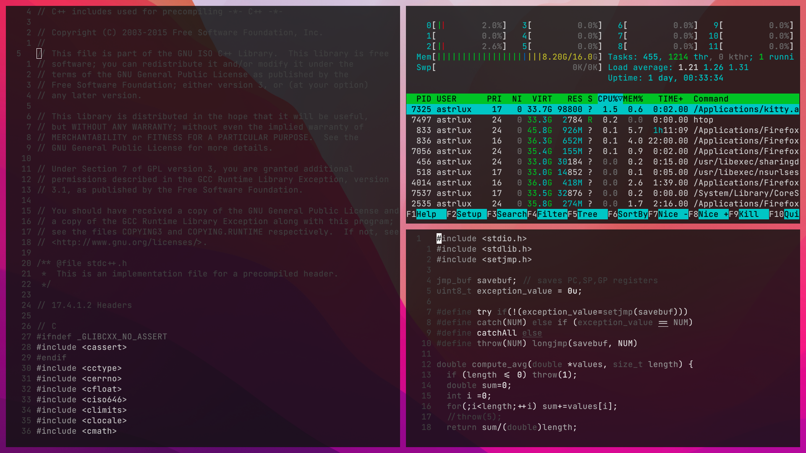
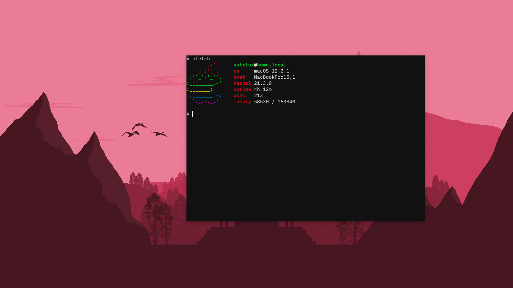
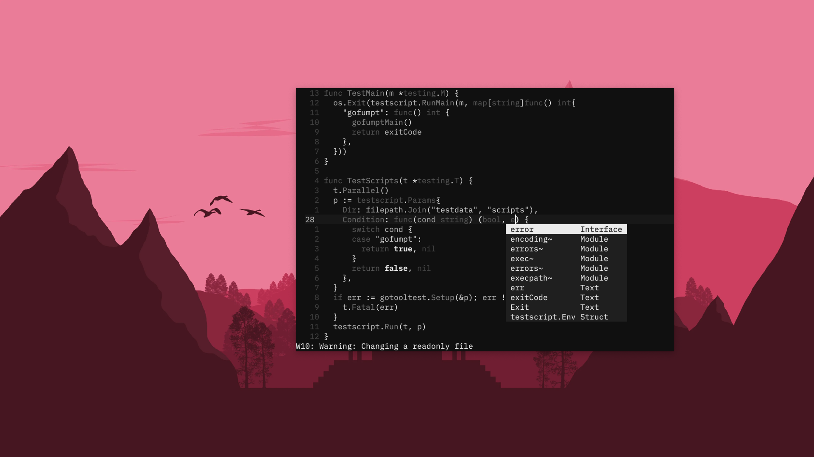
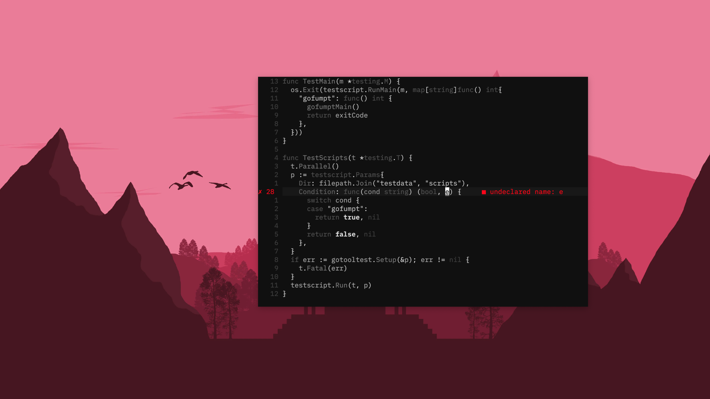

Click for Pictures!

### Requirements [5 min]

1. *nix system (I use Arch linux and macOS)
2. GNU/[Stow](https://www.gnu.org/software/stow/)
3. neovim [v0.5+](https://neovim.io/).

### Installation [5 sec]

    cd && git clone git@github.com:astrlux/dotfiles.git && sudo sh ~/dotfiles/scripts/first_install.sh

Quit & restart your terminal/emulator. Run `:PackerSync`. Finally, you're ready to rumble.

### Sustained Use

Shell commands like `installDotfiles`, `removeDotfiles`, & `commitDotfiles` are at your disposal. For keybinding alterations, look at `.zshrc`, `maps.lua`, or `tmux.conf`. If you've opted to use [kitty](https://sw.kovidgoyal.net/kitty/conf/) like I recommended, you don't need tmux (just press `Ctrl+Shift+Enter`).

### Auxiliary Tools

_efm-language-server llvm luarocks fzf ripgrep thefuck ccls pyright gopls zsh-autosuggestions ninja tree-sitter_

### Optional

1. A Lua language server (I'm using [lua-language-server](https://github.com/sumneko/lua-language-server))
    -   Build this language server following the steps [here](https://github.com/sumneko/lua-language-server/wiki/Build-and-Run-(Standalone)). You'll need [ninja](https://github.com/ninja-build/ninja/wiki/Pre-built-Ninja-packages) and C++17.
    -   The native LSP needs the path to your language server's binary. Hardcode this path in `lsp.lua` (I keep my language server under a `~/tools` folder).

2. For un-_paralleled_ crispness, use a GPU-accelerated emulator like [kitty](https://sw.kovidgoyal.net/kitty/) or [alacritty](https://github.com/alacritty/alacritty).
