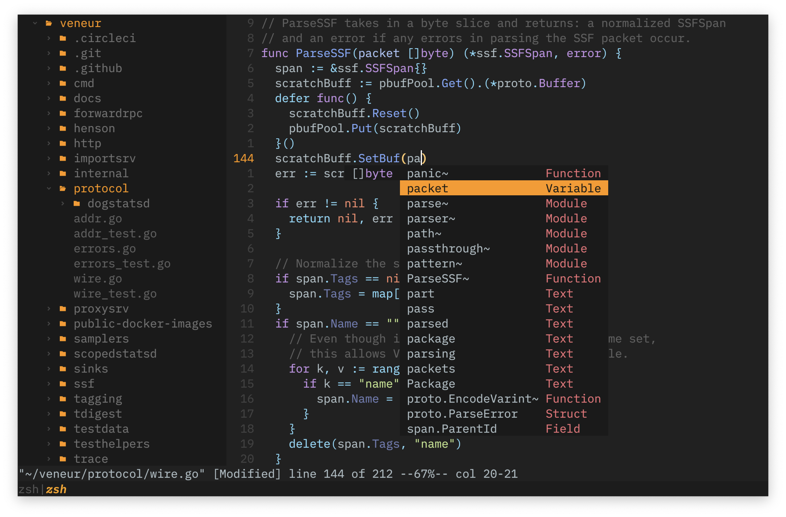
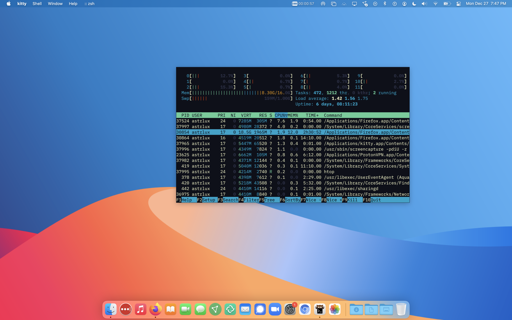

## asynchronous & accelerated, but also _personalized!_ 

<details><summary>Click to see a sexy pic (NSFW Warning)</summary>
</img>
</img>
</details>

### Prerequisites <sup>[5 min]</sup>

1. *nix system, GNU/[Stow](https://www.gnu.org/software/stow/), neovim [v0.5+](https://neovim.io/).

2. A Lua language server (I'm using [lua-language-server](https://github.com/sumneko/lua-language-server))

    -   Build this language server following the steps [here](https://github.com/sumneko/lua-language-server/wiki/Build-and-Run-(Standalone)). You'll need [ninja](https://github.com/ninja-build/ninja/wiki/Pre-built-Ninja-packages) and C++17.

    -   The native LSP needs the path to your language server's binary. Hardcode this path in `lsp.lua` (I keep my language server under a `~/tools` folder).

3. For un-_paralleled_ crispness, use a GPU-accelerated emulator like [kitty](https://sw.kovidgoyal.net/kitty/) or [alacritty](https://github.com/alacritty/alacritty).

### Installation <sup>[5 sec]</sup>

    cd && git clone git@github.com:astrlux/dotfiles.git && sudo sh ~/dotfiles/scripts/first_install.sh


Quit & restart your terminal/emulator. Run `:PackerUpdate`. Finally, you're ready to rumble.

### Sustained Use

Shell commands like `installDotfiles`, `removeDotfiles`, & `commitDotfiles` are at your disposal. For keybinding alterations, look at `.zshrc`, `maps.lua`, or `tmux.conf`. If you've opted to use [kitty](https://sw.kovidgoyal.net/kitty/conf/) like I recommended, you don't need tmux (just press `Ctrl+Shift+Enter`).

### Xtra Tooling

_efm-language-server llvm luarocks fzf ripgrep thefuck ccls pyright gopls zsh-autosuggestions ninja tree-sitter_

___

### Neovim LuaJIT Motivation

- Featherweight configuration prioritizes speed (without nonsensical CPU usage)

- Better-than-IDE experience in under 420 lines of Lua ☾

```
nvim
├── init.lua
└── lua
    └── m
        ├── completion.lua
        ├── filetree.lua
        ├── finder.lua
        ├── highlight.lua
        ├── lsp.lua
        ├── maps.lua
        ├── plugins.lua
        └── sets.lua

2 directories, 9 files
```
